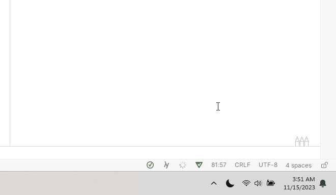

# One-Click Dark Mode - Because Your Eyes Deserve a Break!

Welcome to the coziest little corner of your digital world. Our "One-Click Dark Mode" is not just an app; it's your digital dimmer switch that saves you from the glaring brightness of a thousand suns, also known as your computer screen at midnight.

## Why You'll Love This

- **Simplicity**: It's as easy as flicking a light switch, but you don't even have to stand up to do it!
- **Convenience**: With a single click, you can embrace the darkness... of your screen, that is.
- **Auto-Magic**: Runs stealthily in the background, waiting for your command. No wand-waving necessary.

## Get Started Now!

Don't blink, or you might miss how simple this is.

1. **Run the Magic Script**: Just run `run.ps1` and watch the magic happen.
2. **Sit Back and Relax**: That's it. Seriously. Every time you start Windows, we'll be there, waiting in the tray, ready to serve you a slice of the delightful dark mode.
3. **Toggle Dark Mode**: Right-click to the button to toggle dark mode.

So go ahead, make the switch to the dark side - we have cookies (and less eye strain).

## Disclaimer

Improved night-time visibility are common side effects. Use responsibly.

